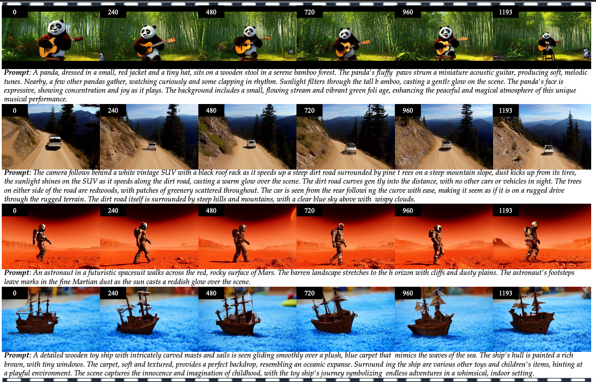

<div align="center">

# Tuning-Free Long Video Generation via Global-Local Collaborative Diffusion
Yongjia Ma, Junlin Chen, Donglin Di, Qi Xie, Lei Fan*, Wei Chen, Na Zhao, Xun Yang
<!-- <p align="center">
<a href=""></a>
</p> -->
</div> 
<p align="center">
    
</p>

**Abstract:**

Creating high-fidelity, coherent long videos is a sought-after aspiration. While recent video diffusion models have shown promising potential, they still grapple  with spatiotemporal inconsistencies and high computational resource demands. We propose GLC-Diffusion, a tuning-free method for long video generation. It models the long video denoising process by establishing denoising trajectories through Global-Local Collaborative Denoising to ensure overall content consistency and temporal coherence between frames. Additionally, we introduce a Noise Reinitialization strategy which combines local noise shuffling with frequency fusion to improve global content consistency and visual diversity. Further, we propose a Video Motion Consistency Refinement (VMCR) module that computes the gradient of pixel-wise and frequency-wise losses to enhance visual consistency and temporal smoothness. 
Extensive experiments, including quantitative and qualitative evaluations on videos of varying lengths (\textit{e.g.}, 3× and 6× longer), demonstrate that our method effectively integrates with existing video diffusion models, producing coherent, high-fidelity long videos superior to previous approaches.


<p align="center">
<video width="800" height="450" controls>
<source src="docs/static/videos/fig1.mp4" type="video/mp4">
Your browser does not support the video tag.
</video>
<br>
<em>Fig. 1: Long video generation exceeding 1,000 frames with GLC-Diffusion (based on CogVideoX)</em>
</p>


Qualitative Comparison (3× Length)
<p align="center">
<video width="800" height="450" controls>
<source src="docs/static/videos/fig4_video_length_3.mp4" type="video/mp4">
Your browser does not support the video tag.
</video>
</p>
Qualitative Comparison (6× Length)
<p align="center">
<video width="800" height="450" controls>
<source src="docs/static/videos/fig4_video_length_6.mp4" type="video/mp4">
Your browser does not support the video tag.
</video>
</p>
Ablation Study Results
<p align="center">
<video width="800" height="450" controls>
<source src="docs/static/videos/fig5_ablation.mp4" type="video/mp4">
Your browser does not support the video tag.
</video>
<br>
<em>Impact of key components (w/o GLCD, w/o global path, w/o local path, etc.)</em>
</p>
Multi-Prompt Video Generation
<p align="center">
<video width="800" height="450" controls>
<source src="docs/static/videos/fig6_multiprompt.mp4" type="video/mp4">
Your browser does not support the video tag.
</video>
<br>
<em>Long video generation with evolving narrative via multi-prompt guidance</em>
</p>

# Citation
```shell
@article{ma2025tuning,
  title={Tuning-Free Long Video Generation via Global-Local Collaborative Diffusion},
  author={Ma, Yongjia and Chen, Junlin and Di, Donglin and Xie, Qi and Fan, Lei and Chen, Wei and Gou, Xiaofei and Zhao, Na and Yang, Xun},
  journal={arXiv preprint arXiv:2501.05484},
  year={2025}
}
```